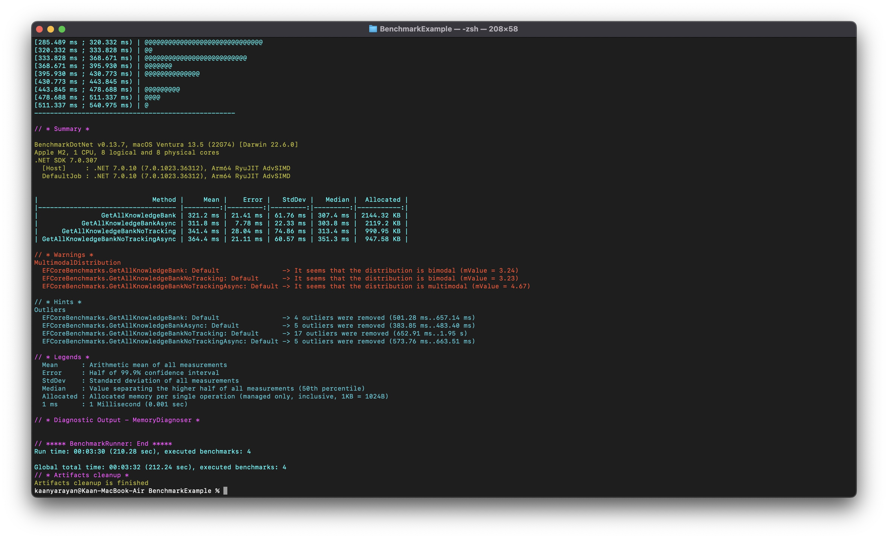

---
title: EF Core Tracking'in Görünmeyen Bedeli
excerpt: AsNoTracking tek bir satır gibi görünür. Ama bellek tüketimini neredeyse yarıya indirir.
date: 2026-03-06
series: Çalışıyor Ama Kaça Mal Oluyor?
chapter: 2
tags: [efcore, dotnet, performance, orm, optimization]
---

Bir endpoint düşünelim. Bilgi bankasındaki kayıtları getiriyor. Gayet sıradan bir sorgu.

Her şey çalışıyor. Hiç hata yok. Ama merak ettim ve küçük bir deney yaptım.

## 🧪 Benchmark Kurulumu

Aynı sorgunun dört versiyonunu benchmark ettim:

- `GetAllKnowledgeBank`
- `GetAllKnowledgeBankAsync`
- `GetAllKnowledgeBankNoTracking`
- `GetAllKnowledgeBankNoTrackingAsync`

Kodda tek fark var:

```csharp
.AsNoTracking()
```



## 📊 Sonuçlar

**Tracking açık olan sorgular:**

- Ortalama süre: ~320 ms
- Memory allocation: ~2100 KB

**NoTracking kullanılan sorgular:**

- Ortalama süre: ~340–360 ms
- Memory allocation: ~950 KB

Burada küçük ama önemli bir şey oluyor.

NoTracking bazı durumlarda birkaç milisaniye daha yavaş görünebilir. Ama memory allocation neredeyse yarıya düşüyor.

> **Kabaca: %55 daha az bellek tüketimi.**

## 🔍 Peki Bu Neden Önemli?

Şimdi bunu gerçek bir sistemde düşünelim. Bu endpoint:

- Saniyede yüzlerce kez çağrılıyor olabilir
- Büyük listeler döndürüyor olabilir
- Uzun süre çalışan bir API olabilir

Her request'te fazladan ~1 MB allocation üretildiğini hayal et. Bir süre sonra:

- Garbage Collector daha sık çalışır
- CPU kullanımı artar
- Latency dalgalanmaya başlar

Ve ekipte biri bir gün şu soruyu sorar: **"API bazen neden yavaşlıyor?"**

Çoğu zaman cevap karmaşık algoritmalar değildir. Cevap çoğu zaman küçük ORM davranışlarıdır.

## 💡 Ne Zaman AsNoTracking Kullanmalı?

EF Core'un tracking mekanizması güçlüdür — entity değişikliklerini takip eder. Ama her sorgunun bu takibe ihtiyacı yoktur.

Eğer veri sadece **okunacaksa** ve geri yazılmayacaksa, tracking gereksizdir. Bu yüzden küçük bir satır bazen büyük fark yaratır:

```csharp
var list = await _context.KnowledgeBank
    .AsNoTracking()
    .ToListAsync();
```

---

Yazılım dünyasında ilginç bir gerçek var.

Çoğu sistem yanlış çalıştığı için değil, **gereğinden pahalı çalıştığı için** zorlanır.

Serimizin sorusu da tam olarak bu: *Çalışıyor… ama kaça mal oluyor?*